# 人工智能原理——文本数据的分类与分析

班级：2021211301  
姓名：郭栩源  
学号：2021213586  

## 一、实验目的

1. 掌握数据预处理的方法，对训练集数据进行预处理；
2. 掌握文本建模的方法，对语料库的文档进行建模；
3. 掌握分类算法的原理，基于有监督的机器学习方法，训练文本分类器；
4. 利用学习的文本分类器，对未知文本进行分类判别；
5. 掌握评价分类器性能的评估方法。

## 二、实验分工

本实验由本人独立完成。

## 三、实验环境

服务器：系统环境为Ubuntu20.04，CPU为AMD Ryzen 9 7900X，GPU为Geforce RTX 4090。  
个人电脑：系统环境为Windows 10 专业版 22H2，CPU为12th Gen Intel Core i5-12490F，GPU为Geforce RTX 4060 Ti。  
开始时在 PC 上实验，但因为想要使用带有 GPU 加速的 cuML 库，所以选择在Linux环境下进行。  
本实验使用的主要Python库有：

- cuML 23.12.00  
  CuML 是专为数据科学和分析任务而设计的一套快速的 GPU 加速机器学习算法库，能让使用者在不了解 CUDA 编程细节的情况下使用 GPU 加速传统机器学习算法。[cuML官方文档](https://docs.rapids.ai/api/cuml/stable/)。
- jieba 0.42.1  
  Jieba 是一个支持三种分词模式和繁体分词的 Python 中文分词组件，可以快速切分 Chinese 文本。  
  根据[清华大学对各个分词工具在大数据上进行的速度评测](https://github.com/thunlp/THULAC-Python)，可以看出，即使结巴在分词准确度上稍有欠缺，速度却是较快的：
    |Algorithm | Time | Speed |
    |:------------|-------------:|------------:|
    |LTP-3.2.0 | 348.624s  | 149.80KB/s|
    |ICTCLAS(2015版) | 106.461s | 490.59KB/s|
    |jieba|22.5583s|2314.89KB/s|
    |THULAC | 42.625s  | 1221.05KB/s|
- matplotlib 3.7.2 和 seaborn 0.12.2  
  Matplotlib是一个全面的Python可视化库，用于创建静态、动画和交互式可视化。  
  Seaborn 是基于 matplotlib 的数据可视化库，提供了能够绘制携带更多信息且更美观的图表的强大接口。  
  此实验中用于可视化混淆矩阵。
- scikit-learn  
  Scikit-learn是用于Python编程语言的自由软件机器学习库。它包含了各种分类、回归和聚类算法。  
  此实验中主要用于计算分类器性能指标。

## 四、主要思想

### 1.文本特征提取

本次实验使用词袋模型（Bag of Words，简称 BoW）来提取文本特征。  
词袋模型忽略了文本中词汇的顺序和语法，只考虑词汇的出现频率。每个文档被表示为一个长向量，此向量的长度为词汇表（语料库中所有不同词的集合）的大小。在向量中，每一个维度对应词汇表中的一个词。如果某个词在文档中出现，该词对应的向量维度上的值就是该词在文档中出现的次数或者是一个加权值。  
在词袋模型的基础上，可以使用TF-IDF代替词频表征文档特征。  
TF_IDF：TF为词频，指的是某一个给定的词语在该文档中出现的频率；IDF为逆向文档频率，某一特定词语的IDF，可以由一类文件中的总文件数目除以该类中包含该词语之文件的数目，再将得到的商取对数得到。  
使用TF-IDF作为提取文档特征的方法，既考虑了某类文档中出现的高频词，又降低了在所有文档中都频繁出现的词的影响（这些词在所有文档中都频繁出现，没有办法表征某类文档的特性）。  
使用词袋模型提取文本特征的步骤如下：  

1. 分词。中文不同于英文等语言的文本，没有天然的空格作为分隔符，所以需要使用专门的分词工具进行中文分词。
2. 取名词，去停用词。一般认为一篇文档中的名词能够更好地描述一篇文档的特征（文本情感分析中，形容词也很重要），而停用词是频繁出现的功能词或无实际意义的词语，在特征提取时需要删去。
3. 建词典。经过分词和取名词、去停用词，剩下的单词构成语料库的词典。也可以人工选择部分词语建立词典。
4. 文档对齐。
5. 统计词频（TF-IDF）。将文档向量化，对于每个文档，根据其包含的词和词汇表创建一个向量，向量的每个元素代表词汇表中对应词的出现次数或频率（或TF-IDF值）。

### 2.分类器

此次实验使用SVM作为分类器。SVM分类器在解决小样本、非线性及高维度的分类问题中具有很多优势，核函数的引入使得 SVM 对问题的处理是与样本的维数无关的。  
SVM数学原理参考李航的《统计学习方法》第二版：
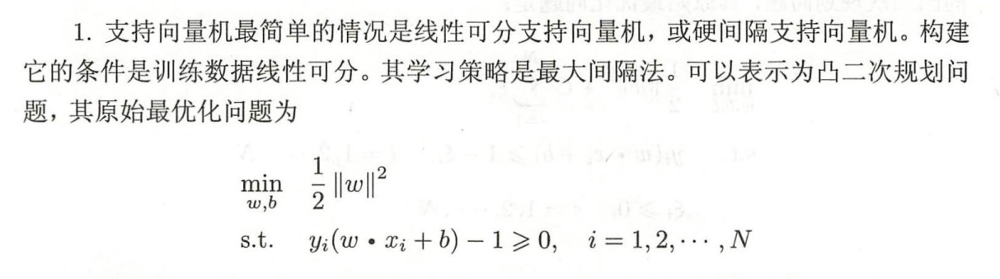
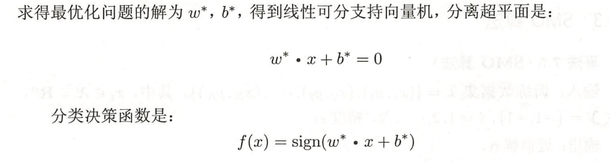
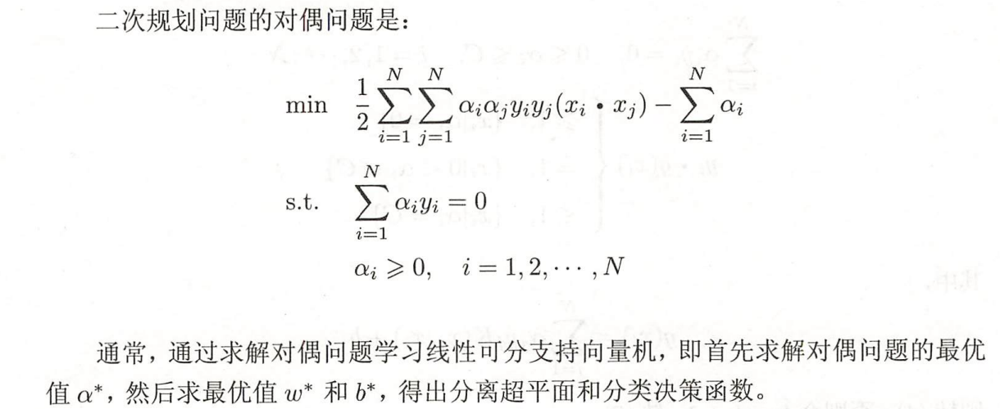
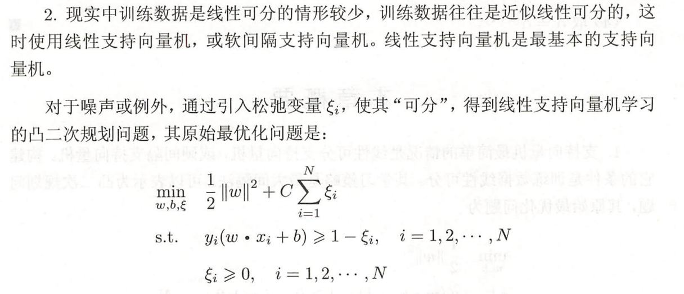
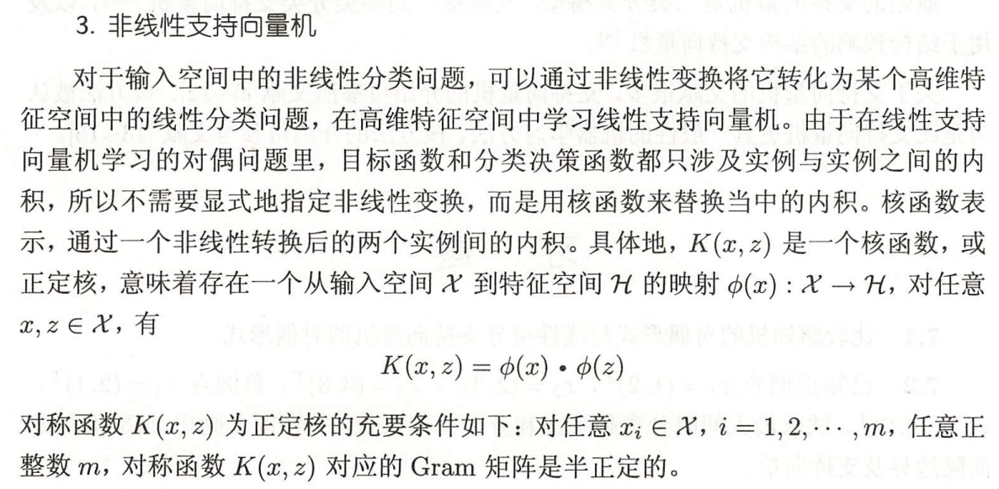
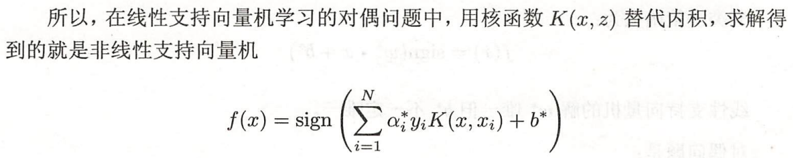

### 3.性能评价

本实验使用精确率（precision），召回率（recall），和F1-测度（F1-score）来作为性能评价的指标。
||实际正例|实际负例|
|:--:|:--:|:--:|
|预测正例|TP|FP|
|预测负例|FN|TN|

precision=TP/(TP+FP)，在所有判断为正确的文档中，有多少是实际正确的；  
recall=TP/(TP+FN)，在实际为正确的文档中，有多少被判断成正确；  
F1-score=2\*P\*R/(P+R)，结合precision和recall，既衡量精确率又衡量召回率。

## 五、实验过程

### 1.语料库的获取

由于百万级的语料库获取难度较大，本人最终使用清华大学提供的[THUCNews中文文本数据集](http://thuctc.thunlp.org/)。THUCNews是根据新浪新闻RSS订阅频道2005~2011年间的历史数据筛选过滤生成，包含百万篇新闻文档，均为UTF-8纯文本格式。  
我从THUCNews数据集中挑选出10个类别的文档（家居、游戏、财经、体育、科技、娱乐、股票、时政、社会、教育），以训练集-测试集比例为1：1的比例划分为训练集和测试集。训练集包含395,747篇文档，平均每类约40,000篇；测试集包含395,747篇文档，平均每类40,000篇。

### 2.数据处理与特征提取

- jieba分词  
  对所有文档使用jieba库进行分词，并取其中词性为名词的词。  

  ```python
  def jieba_cut(content):
    words = posseg.cut(content)
    nouns = [word for word, flag in words if flag.startswith('n')]
    return " ".join(nouns)


  def multi_thread_jieba_cut(row_data):
      print("JIEBA分词……")
      # 使用python线程池实现多线程jieba分词
      with ProcessPoolExecutor() as executor:
          data = list(executor.map(jieba_cut, row_data))
      return data
  ```

  处理后结果示例如下：

  >'施工方 雇 人 征地 村民 新华网 呼和浩特 王洪禹 内蒙古 煤炭企业 农村土地 问题 村民 施工方 人员 身份 人员 名 情况 村民 用车 事发 内蒙古自治区 鄂尔多斯市 准格尔旗 龙口 镇柏 相公 村 火盘 社 煤炭企业 露天煤矿 方面 征地 公告 柏 相公 村 火盘 社 村民 集体 耕种 土地 村民 补偿款 异地 房屋 村民 标准 村民 杜三后 钱 房屋 新家 村民 名 代表 自治区 政府 机关 情况 房屋 村民 房屋 情况 村民 房子 身份 人员 木棒 房子 门窗 名 村民 全部 院子 塞进 小时 车程 村民 杜三后 高速公路 被劫持 村民 人 村民 人 穿鞋 赤脚 人 出租车 呼和浩特市 察素 齐镇 杜三后 人 房屋 报警 警方 现场 被劫持 村民 村民 当地政府 旅店 记者 准格尔旗 警方 案发后 名 村民 嫌疑人 嫌疑人 矿区 施工队 村民 警方 人 公私 财物 中国法学会 刑法 专业 委员会 委员 张平 案件 案件 警方 立案侦查 公私 财物罪 村民'

- 求TF-IDF矩阵  
  使用cuml.feature_extraction.text.TfidfVectorizer库进行TF-IDF矩阵的求取（同时也完成去停用词工作）。

  ```python
  def get_tfidf(data, mode, stopwords_list):
    print("计算TF-IDF……")
    data = cudf.Series(data)
    if mode == 'train':
        # 使用TF-IDF进行特征提取，此语句涵盖建词典、文档对齐和统计TF-IDF
        tfidf_vectorizer = TfidfVectorizer(stop_words=stopwords_list)
        tfidf = tfidf_vectorizer.fit_transform(data)
        # 输出词典
        word_list = tfidf_vectorizer.get_feature_names().to_pandas()
        with open('vocabulary.txt', 'w', encoding='utf-8') as file:
            for word in word_list:
                file.write(word + '\n')
        # 保存TF-IDF向量器和选择特征索引
        with open('model/tfidf_vect.pickle', 'wb') as f:
            pickle.dump(tfidf_vectorizer, f)
    else:
        with open('model/tfidf_vect.pickle', 'rb') as f:
            tfidf_vectorizer = pickle.load(f)
        tfidf = tfidf_vectorizer.transform(data)
    return tfidf
  ```
  
  TF-IDF提取后得到TF-IDF矩阵，处理后结果示例如下（以稀疏矩阵形式展示）：

  >(0, 111)      0.21122605  
  (0, 167)      0.480597  
  (0, 383)      0.2402985  
  (0, 425)      0.2402985  
  (0, 462)      0.21122605  
  (0, 476)      0.2402985  
  (0, 660)      0.2402985  
  (0, 677)      0.2402985  
  :     :  
  (19, 930)     0.06981083  
  (19, 940)     0.06981083  
  (19, 976)     0.13962166  
  (19, 1018)    0.06981083  
  (19, 1046)    0.06981083  
  (19, 1049)    0.06981083  
  (19, 1050)    0.06981083  
  (19, 1052)    0.13962166  

- 卡方特征提取  
  求出TF-IDF特征矩阵以后，对于每类文档，求出最能够代表这类文档的k个特征，最后将所有选择的特征合并，组建新的词典，以实现特征降维。

  ```python
  def chi2_select(tfidf, label, mode, k=300):
    print("chi2特征选择……")
    if mode == 'train':
        select_features = np.zeros(tfidf.shape[1], dtype=bool)
        # 创建一个二元标签，某类文档标签为1，其他类文档标签为0
        unique_label = np.unique(label)
        for each in unique_label:
            label_binary = label == each
            # 卡方特征选择
            selector = SelectKBest(chi2, k=k)
            selector.fit_transform(tfidf.get(), label_binary)
            # 不同类别可能选出相同特征，使用“或”运算进行合并
            select_features = np.logical_or(select_features, selector.get_support())

        np.save('data/select_features.npy', select_features)
    else:
        select_features = np.load('data/select_features.npy')

    # 将原始TF-IDF矩阵映射到所选取的特征中
    tfidf_selected = tfidf[:, select_features]
    return tfidf_selected
  ```

- 将预处理后训练集和数据集保存到文件中，在训练调参时可以直接从文件中加载，而不需要重新进行文件读取和数据预处理（以训练数据为例）。  
  
  ```python
  save_npz('data/train_tfidf.npz', data)
  np.save('data/train_label.npy', label)
  ```

   训练数据和测试数据以如下形式存储在data文件夹下（其中tfidf为tfidf矩阵，label为对应类别标签）：  

  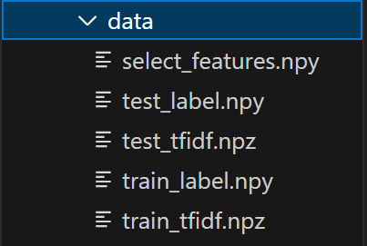

### 3.训练与测试

- 从保存的.npy和.npz文件中加载训练数据和测试数据（以训练数据为例）。

  ```python
  x_train = load_npz('data/train_tfidf.npz').toarray()
  y_train = np.load('data/train_label.npy')
  ```

- 模型训练  
  使用cuml.svm.LinearSVC作为线性核的SVM模型，创建模型，对模型进行训练，并计算训练集的精确率、召回率、F1-测度。

  ```python
  # 创建 SVM 模型
  model = LinearSVC(penalty='l1', loss='hinge', class_weight='balanced', C=10)
  # 训练 SVM 模型
  model.fit(x, y)
  # 使用模型进行预测
  y_pred = model.predict(x)
  # 计算总体精确率
  precision = precision_score(y, y_pred, average='micro')
  # 计算总体召回率
  recall = recall_score(y, y_pred, average='micro')
  # 计算总体F1测度
  f1 = f1_score(y, y_pred, average='micro')
  ```

- 模型测试  
  使用cuml.svm.LinearSVC作为线性核的SVM模型，在测试集上对训练好的模型进行测试，并计算训练集的各类别的精确率、召回率、F1-测度和总体精确率、召回率、F1-测度。

  ```python
  # 加载 SVM 模型 
  with open('model/model.pickle', 'rb') as f:
      model = pickle.load(f)
  # 使用模型进行预测
  y_pred = model.predict(x)
  categories = model.classes_
  # 计算每类的精确率
  precision = precision_score(y, y_pred, average=None)
  # 计算每类的召回率
  recall = recall_score(y, y_pred, average=None)
  # 计算每类的F1测度
  f1 = f1_score(y, y_pred, average=None)
  # 计算总体精确率
  precision_overall = precision_score(y, y_pred, average='micro')
  # 计算总体召回率
  recall_overall = recall_score(y, y_pred, average='micro')
  # 计算总体F1测度
  f1_overall = f1_score(y, y_pred, average='micro')
  # 计算混淆矩阵
  cm = confusion_matrix(y, y_pred)
  ```

进行一次训练，输出示例如下：
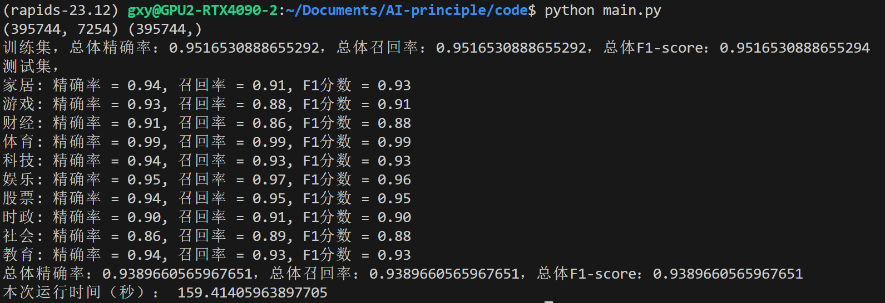
打印混淆矩阵如下：
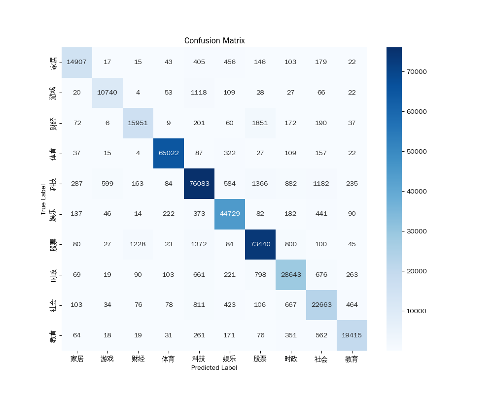

## 六、模型调参

在对SVM进行调参时，首先对特征维度进行调参。在对特征维度进行调参时，发现在一定范围内增大特征维度，可以有效提高精确率、召回率和F1-测度。但由于 GPU 显存有限，当特征维度增加到8000维时，出现了 CUDA out of memory 错误。所以最终确定训练、测试集大小=395744，特征数量=7254。  

### 1.调整正则化方式和损失函数
  
在cuML库中，为cuml.svm.LinearSVC提供了两种常用的正则化方式和损失函数：

- l1正则化搭配hinge损失函数
- l2正则化搭配squared_hinge损失函数（默认）

固定C=4，对这两种搭配分别进行测试，同时我也尝试使用l1正则化搭配squared_hinge损失函数和使用l2正则化搭配hinge损失函数。  
使用l1正则化搭配hinge损失函数：  
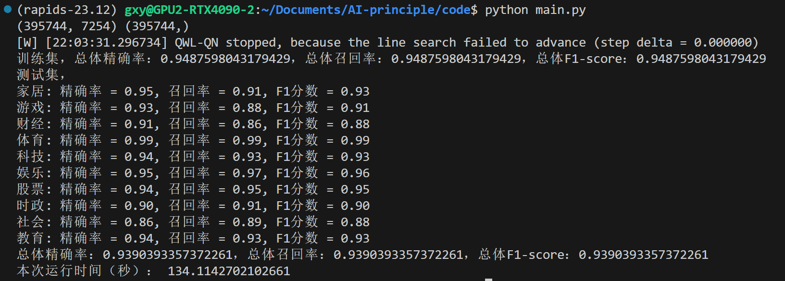
使用l1正则化搭配squared_hinge损失函数：  
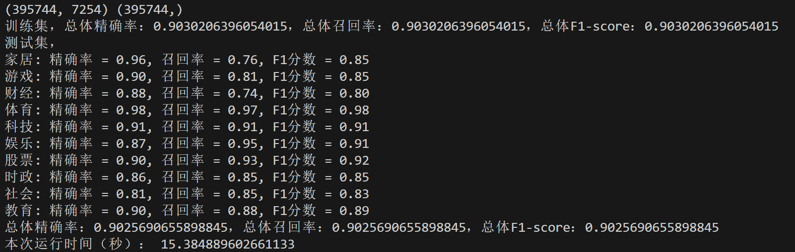
使用l2正则化搭配squared_hinge损失函数:  
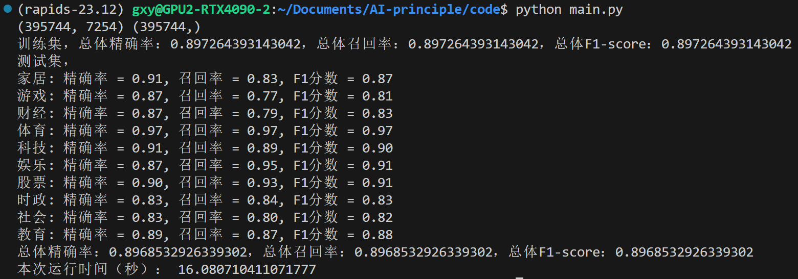
使用l2正则化搭配hinge损失函数:  
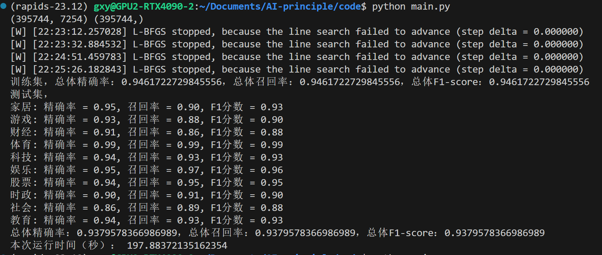
可以看到，l1正则化在性能上要略好于l2正则化，使用hinge损失函数性能远好于使用squared_hinge损失函数。  
导致这种结果的可能原因是，l1正则化能够产生稀疏模型，即模型中有更多权重为0，这使得其能够专注于更重要的特征；而l2正则化倾向于分散权重，提高模型的泛化性，降低过拟合的风险，但是对于重要特征的把控不如l1正则化。
为了保证较高的准确率，在以下所有测试中，都使用l1正则化搭配hinge损失函数。

### 2.调整惩罚系数C

SVM中的惩罚系数C决定了对误差的容忍，C越大，对误差的容忍度越低。C过大和过小时，都会降低模型的泛化能力。  
在调整正则化方式和损失函数时，已经在C=4的情况下做过测试，接下来本人逐渐增大C，寻找精确率、召回率、F1-测度的峰值。

C=5：
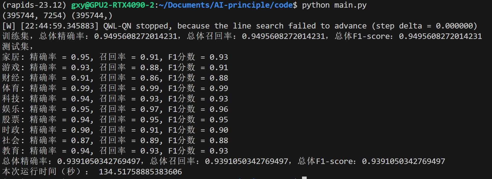

C=5.5:
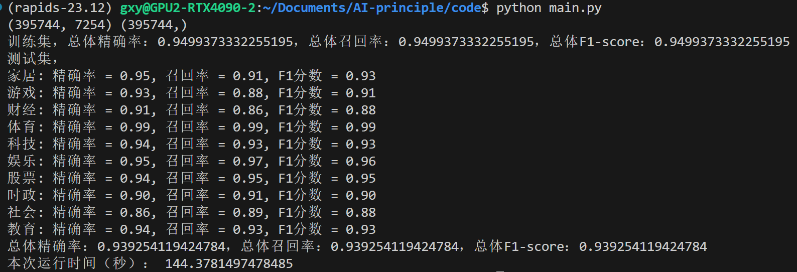

C=6:
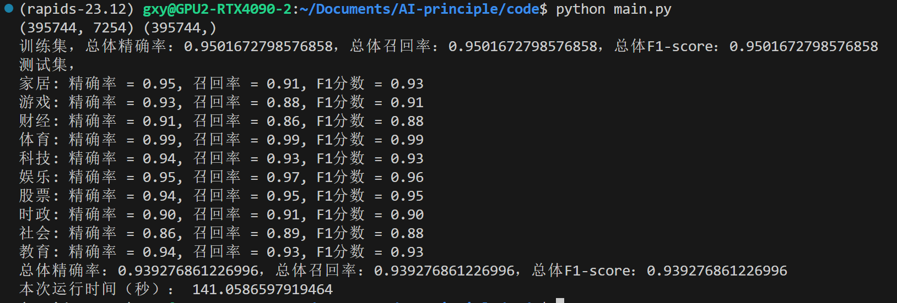

C=6.5：


可以看到，当C增大到6.5时精确率、召回率、F1-测度已经有所回落，因此最佳C值应该在5.5~6.5之间。其实接下来可以使用二分区间的方法继续进行调参，但是考虑到此时的精确率已经固定在小数点后4位，已经没有较大的变化，故使用C=6。

## 七、效率优化

在（三、实验环境）中也有说明，本次实验开始时是在 windows 平台下完成的，但是在 windows 下使用 scikit-learn 中的 SVM 速度过慢（下图为在数据规模为50000+50000时，使用 sklearn 提供的 SVM 库进行一轮训练与测试）：  

可以看到，仅仅是在十万数据集的规模下，完成一轮训练与测试也需要2100秒（约35分钟），这样的速度显然无法很好得完成百万数据集的分类任务。

使用cprofile和snakeviz库可以可视化查看那个函数造成了程序的时间瓶颈:

从图中可以看到，clean函数（修改后为multi_thread_jieba_cut函数），即分词步骤占用了程序执行的主要时间，造成了程序的效率瓶颈。  

因此，对程序效率的优化着重于以下两个方向：

1. 优化 jieba 分词速度
2. 优化 SVM 训练的速度

本人分别使用多线程 jieba 分词和使用支持GPU加速的机器学习库 cuML 解决了上述两个优化问题。优化后，在八十万数据的规模下，从原始数据开始完成整个流程（包括数据集载入、数据预处理和特征提取、模型的训练于测试）只需要700秒左右；仅进行模型的训练和测试需要150秒左右；如果加载训练好的模型，仅对测试集进行测试，则只需要7秒即可完成。  

对于程序效率的优化为后续进行调参提供了可能性。同时，程序的效率也是实际工程中所必须考虑的问题，即，在保证一定准确率的前提下，程序运行的速度也不能太慢。

## 八、实验代码

详见压缩包中的.py文件。下面对这些文件进行简要介绍：  

|文件名|介绍|
|:--:|:--:|
|dataloader.py|从文件中加载数据|
|preprocess.py|分词、去停用词、计算TF-IDF和卡方特征选择等数据处理|
|model.py|使用 SVM 模型进行训练和预测|
|main.py|主函数|

## 九、结果分析与实验总结

### 1.结果分析

观察C=6时的运行结果（见（六、模型调参）），可以看到：

1. 模型总体精确率、召回率与F1-测度均为0.94，且三者大小相同。这是因为，在计算总体精确率、召回率与F1-测度时使用micro-average模式，具体证明如下：  
   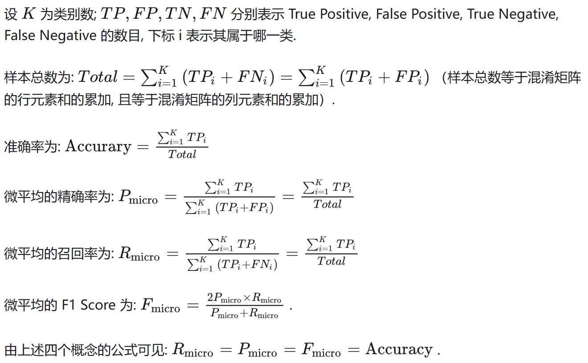
2. 体育类文档具有最高的精确率、召回率以及F1-测度
3. 社会类与财经类的精确率、召回率以及F1-测度较低

在此基础上，打印C=6时的混淆矩阵：
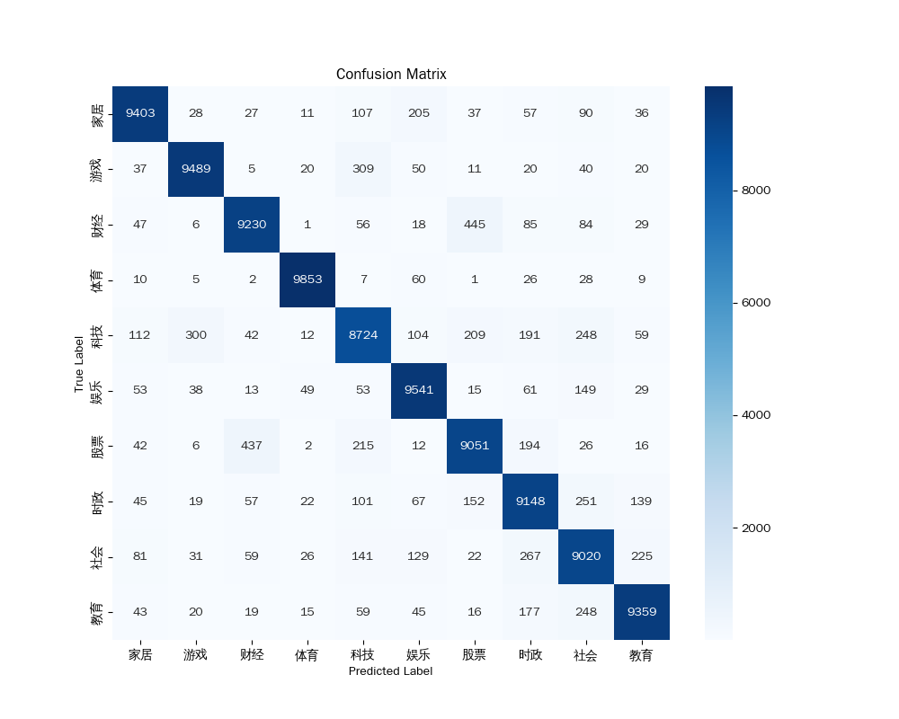
从混淆矩阵中可以看到，游戏类与科技类、财经类与股票类、科技类与股票类和社会类间存在较多的误分。

### 2.实验总结

本次实验的实验过程包括了数据预处理、特征提取、模型训练和测试，以及模型的性能评估。我使用了SVM作为分类器，并使用了不同的特征提取方法和正则化技术。实验结果显示，使用L1正则化配合hinge损失函数的SVM模型在性能上略优于L2正则化，这可能是因为L1正则化能产生更稀疏的模型，更专注于重要特征。我还对模型的惩罚系数进行了调参。实验结果表明，当惩罚系数C为6时，模型达到了较高的精确率、召回率和F1-测度。此外，我还进行了效率优化，通过使用GPU加速的机器学习库和多线程分词来提高模型训练和测试的速度。

从这次实验中，我获得了几个重要的心得体会：

1. 数据预处理的重要性：数据的质量直接影响模型的表现。对于原始数据合理的预处理是提高模型性能的关键步骤。
2. 特征选择的影响：选择合适的特征对模型的性能有显著影响。使用卡方特征选择能在特征降维的同时保证模型准确率。
3. 模型参数调优：合理调整模型的参数对提高模型性能至关重要。实验中，调整正则化强度、损失函数和惩罚系数显著影响了模型的表现。
4. 效率与性能的平衡：在追求模型性能的同时，也需要考虑到计算资源的限制。通过优化算法和利用高效的计算资源，可以在保证性能的同时提高模型的训练和测试速度。

这些心得对于未来在机器学习和数据科学领域的工作将非常有用，特别是在面对大数据和复杂模型时，这些经验可以指导我进行更有效的数据处理和模型优化。
